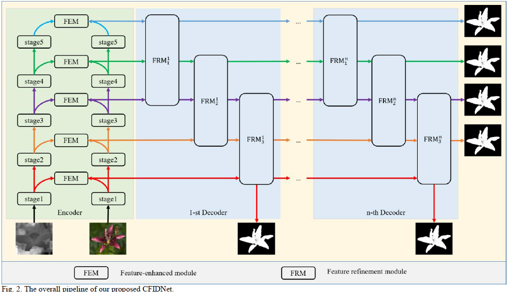
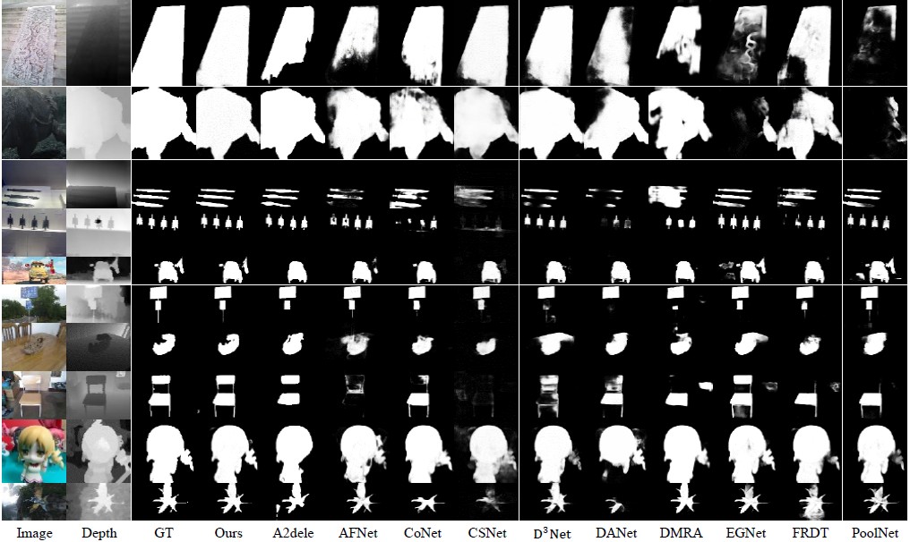

# CFIDNet
# [CFIDNet: Cascaded Feature Interaction Decoder for RGB-D Salient Object Detection]()

This repo. is an official implementation of the *BPFINet* , which has been accepted in the journal *Neural computing and applications, 2022*. 

The main pipeline is shown as the following, 


And some visualization results are listed 


## Dependencies 
```
>= Pytorch 1.0.0
OpenCV-Python
[optional] matlab
```

## Training
pretrained resnet50 is available at ([Baidu](https://pan.baidu.com/s/1K4-b6JPi6E34kgH8gdbYqQ)) [code:nfih]
```
python main.py --mode=train
```

## Test
```
 python main.py --mode=test --model=./pretrained/best.pth --sal_mode="DES"
```
We provide the trained model file ([Baidu](https://pan.baidu.com/s/1HJw29uX4aFRAyRKYBWupkw)) [code:itp2]

The saliency maps are also available ([Baidu](https://pan.baidu.com/s/13AVPlbqQuuUL-k1p4s3Hqw)). [code:labl]

## Citation
Please cite the `CFIDNet` in your publications if it helps your research:
```
@article{CHEN2021,
  title = {CFIDNet: Cascaded Feature Interaction Decoder for RGB-D Salient Object Detection},
  author = {Tianyou Chen and Xiaoguang Hu and Jin Xiao and Guofeng Zhang and Shaojie Wang},
  journal = {Neural Computing and Applications},
  year = {2022},
}
```
## Reference
[poolnet](https://github.com/backseason/PoolNet)
